# Design & Testing Workflow Strategy

**Status:** Strategy v5, 2026-09-17. Folds in the v4 review (worktree visibility, parallelism, language stops, visual evals, fork maintenance). Next step: build the fork, then pilot on one feature (see "Build list" and "Pilot").

## Summary

Stay in Claude Code; no external orchestrator. Remove `superpowers` entirely. Fork `mattpocock/skills` and maintain it as a personal set, adding a thin layer on top: proactive language alignment, visual design review, visual evaluation at the end of every chunk of work, and a build orchestrator (the SDD phase) that combines Pocock's `implement-spec` with the best parts of superpowers' subagent-driven development. The workflow is Design → Plan → Build → Close.

## Decisions

| Decision | Choice |
|---|---|
| Orchestration | Pure Claude Code (skills, `CLAUDE.md`, subagents). Revisit only for batch design of many modules at once. |
| Base skill set | Fork `mattpocock/skills`, maintain it. Keep `upstream` remote. |
| `superpowers` | Remove completely (uninstall plugin, which removes its SessionStart hook). Bring over four ideas, listed below. |
| Scope | Personal use. |
| Language alignment | Eager, on triggers A and B only, and only in interactive sessions with you. Subagents and the orchestrator never stop on language. |
| Issue tracker | Local files: `.scratch/<feature>/issues/`, committed to the feature branch before Build. |
| Review cadence | Review after every ticket, plus a whole-branch review at the end. |
| Fix loop | At most 2 fix rounds per ticket, then escalate to you. |
| Autonomy during build | Small implementation calls are ruled on and logged. Design forks and seam-changing drift stop the run; the orchestrator then works the resolution out with you. |
| Parallelism | Tickets run in parallel only when their declared modules don't overlap; otherwise one at a time. |
| Visual eval | Every chunk of work Claude is sent out to complete ends with one, whatever its size. |

## Why stay in Claude Code

External orchestrators earn their keep for deterministic control flow across many agents, enforcement outside an interactive session, or batch fan-out. The gap here is judgment and shared language applied at the right moment inside a session, which is what skills, `CLAUDE.md` and subagents are for. The Pocock repo is the proof: a full idea → spec → tickets → TDD → review flow, with parallel subagents and HTML visual reports, built from skills alone.

## Why Pocock over superpowers

The three original pain points were: no real design judgment, mechanical testing (over-mocking, implementation-coupled tests), and no clear test strategy. Pocock's skills address all three directly:

| Need | Covered by | How |
|---|---|---|
| Design judgment | `codebase-design` | Glossary: module, interface, depth, seam, adapter, leverage, locality. Deletion test. "The interface is the test surface." "One adapter = hypothetical seam, two = real." |
| Design it twice | `codebase-design/DESIGN-IT-TWICE.md` | 3+ parallel subagents with different constraints, compared on depth, locality, seam placement. |
| Test strategy | `tdd` + `codebase-design/DEEPENING.md` | Tests only at seams agreed up front. Mock only at system boundaries. Dependency categories decide how each module is tested. "Replace, don't layer." Named anti-patterns: implementation-coupled, tautological, horizontal slicing. |
| Language alignment | `grilling` + `domain-modeling` | Numbered question rounds with recommended answers. `CONTEXT.md` glossary with `_Avoid_` synonyms; ADRs only when hard to reverse, surprising, and a real trade-off. |
| Spikes | `prototype` | Throwaway code that answers one design question (logic → single HTML file; UI → switchable variants), kept on a `prototype/<name>` branch with only the validated decision folded into main. |
| Visualization (partial) | `improve-codebase-architecture`, `prototype` | HTML reports with before/after diagrams; clickable single-file logic prototypes. |

Superpowers can't sit alongside these. Its SessionStart hook injects a rule that any skill with "even a 1% chance" of applying must run before anything else, including clarifying questions. `brainstorming` claims all creative work and `test-driven-development` claims every feature, so the two sets compete for exactly the same moments, and the winner is whichever description is worded more forcefully. Its style also runs the other way: it owns the process through hard rules ("Iron Law", "delete means delete"), about 3,400 lines across 14 skills, against about 580 lines for the Pocock skills being kept.

**Ideas brought over from superpowers:**

1. **Evidence before claims** (`verification-before-completion`): nothing is reported as working without having just run the command that proves it. Goes into `evaluate-output` and the build orchestrator.
2. **Size the task and say so** (`brainstorming`): spike, bounded or architectural, announced out loud, only ever escalated. Decides whether planning and the visual design review happen at all. The every-task approval gate is not brought over.
3. **Name the break** (`writing-good-tests`): each test states which production change would make it fail; tests that only catch deliberate decisions (a constant's value, message wording) are banned. Added to `tdd`.
4. **When to visualize** (visual companion): show it only when the reader would understand it better by seeing it than reading it. The trigger rule for the visual design review. (The end-of-work eval is always produced.)

## How Pocock's skills compare with the two books

**A Philosophy of Software Design.** Followed closely on module design: deep over shallow modules, design it twice, the deletion test for pass-through modules, and interfaces that include invariants and error modes. His own additions: "seam" and "adapter" (Feathers), the glossary style (DDD), and depth defined as leverage per unit of interface rather than Ousterhout's implementation-to-interface size ratio. Missing: comment-first interfaces, "define errors out of existence", somewhat general-purpose modules, pulling complexity downward, information leakage and temporal decomposition as warning signs, and the strategic vs tactical mindset.

**The Pragmatic Programmer.** Followed loosely: tracer bullets vs throwaway prototypes (matching the book's distinction), reversibility as the ADR trigger, and "don't program by coincidence" in spirit through `diagnosing-bugs`. Orthogonality is implied by seams and locality but never named. Missing: design by contract and assertive programming, property-based testing, broken windows as a daily habit, and DRY as duplicated knowledge.

**Three places they go against the books, and the fork edits that fix them:**

1. **TDD as the core loop.** Ousterhout calls TDD tactical programming. Pocock softens it with pre-agreed seams and vertical slices, but the risk remains. *Fix:* the between-slice design check (defined below), and the drift check in each ticket review.
2. **"Duplicated Code → extract the shared shape"** in `code-review`. The Pragmatic Programmer says DRY is about duplicated knowledge, and Ousterhout warns over-extraction creates shallow modules. *Fix:* rewrite the rule to target the same business rule expressed in two places, not code that looks alike.
3. **Refactoring deferred to review.** Both books favour continuous design investment. *Fix:* the between-slice design check covers this too.

**Book gaps: adopted vs deferred.**

- *Adopted* (as checks in `visual-design-review` and `code-review`): information leakage, pulling complexity downward, temporal decomposition, orthogonality, reversibility, DRY as duplicated knowledge.
- *Deferred* (revisit after the pilot): comment-first interfaces, "define errors out of existence", design by contract / assertions, property-based testing, broken windows as a habit.

## Language alignment triggers

**Where they apply.** Only in interactive, non-implementation work with you: Design and Plan. The build orchestrator and every subagent (implementers, reviewers, merger) skip language alignment entirely: they don't stop, don't ask, don't state readings, and never write `CONTEXT.md`. They use `CONTEXT.md` as it stands.

**Trigger A: a new term that is load-bearing and overloaded across domains.** All three must hold:

- *New*: not in `CONTEXT.md` and not already aligned earlier in the session.
- *Load-bearing*: what gets built changes with the meaning. It names a module, entity, state, rule, or something a test asserts on.
- *Overloaded across domains*: distinct established meanings in two or more fields the work touches, e.g. "session" (auth, analytics, agent run), "event", "account", "job", "model", "context", "run", "policy". Vagueness within one domain doesn't count.

**Trigger B: your usage and the agent's understanding don't match.** Any term, new or not. Signals: usage contradicts `CONTEXT.md`, the code, or the agent's earlier usage in the session, or you correct the agent's paraphrase. To catch this early, during Design and Plan only, the agent states its reading in a few words the first time it acts on a load-bearing term ("treating *session* as the auth session").

**Not a trigger:** general programming terms with one meaning in context, terms used consistently with `CONTEXT.md`, wording preferences, ambiguity that doesn't change the design.

**When it fires:** stop before designing or coding. Ask at most three numbered questions in the `grilling` format. For A: both readings, one concrete scenario they'd handle differently, a recommended answer. For B: "Your usage: … My understanding: … Source: `CONTEXT.md` / code / earlier in session." Write the resolved term to `CONTEXT.md` immediately, other meanings under `_Avoid_`. Escalate to a full `grilling` session only if the answer opens a real design fork.

## The workflow

```mermaid
flowchart LR
    subgraph D[1 · Design: interactive]
        S{Size it} -->|bounded| Q[Short design in chat] --> T0[tdd directly] --> E0[Visual eval]
        S -->|spike| SP[prototype] --> E1[Visual eval]
        S -->|architectural| G[grill-with-docs<br/>+ align-language]
        G --> F{Design fork?}
        F -->|yes| V[Design it twice<br/>+ visual design review]
        F -->|unknown| P[Prototype<br/>max 2 per question]
        V --> Seams[Agree seams]
        P --> G
        F -->|no| Seams
    end
    subgraph PL[2 · Plan]
        Spec[to-spec<br/>+ module/seam diagram] --> Tix[to-tickets<br/>+ modules + dependency graph]
        Tix --> Commit[Commit design artifacts]
    end
    subgraph SDD[3 · Build]
        L[Frontier of tickets] --> I[Fresh implementer<br/>per ticket: tdd]
        I --> R[Ticket review:<br/>spec · standards · drift]
        R -->|fix ≤2 rounds| I
        R -->|design fork / seam drift| Stop[Resolve with you<br/>update spec diagram]
        Stop --> L
        R --> Mg[Merge + full suite]
        Mg --> L
    end
    subgraph C[4 · Close]
        CR[Branch code-review] --> E[Visual task eval<br/>+ rulings] --> M[You merge]
    end
    T0 -.->|turns architectural| G
    I -.->|turns architectural| Stop
    Seams --> Spec
    Commit --> L
    L -->|all done| CR
```

**Plans describe what, not how.** Superpowers' `writing-plans` produces file paths, code and 2–5 minute steps for an engineer assumed to have "questionable taste". Pocock's tickets describe each slice's behaviour and acceptance criteria and deliberately omit file paths and code. Design decisions live in the spec, `CONTEXT.md` and ADRs, and implementers decide details with the code in front of them. This fits Ousterhout far better. The one addition is the list of modules (from the seam diagram) each ticket touches, which the orchestrator needs for parallelism; it names modules, not files.

### 1. Design (interactive)

- **Size the task.** Claude announces spike, bounded or architectural.
  - *Bounded*: a short design in chat, then `tdd`, then `evaluate-output`. No planning.
  - *Spike*: `prototype`, then `evaluate-output`.
  - *Architectural*: the full flow below.
- **Escalation, never de-escalation.** If bounded work turns out to open a design fork, stop `tdd` and re-enter Design as architectural. The same applies during Build (see "Rulings vs stops").
- **Architectural work runs through `grill-with-docs`**, with `align-language` firing throughout. `CONTEXT.md` and ADRs are updated as decisions land.
- **Design forks get drawn.** A real fork runs design it twice, then `visual-design-review`: Mermaid module/seam diagrams, pseudocode as flowcharts or sequence diagrams, and a comparison on depth, locality and seam placement, plus the adopted book checks.
- **Prototype loop cap.** When the answer to a fork is unknown, `prototype` answers it and the result feeds back into grilling. At most two prototypes per question; if it's still open, decide it with you directly.
- **Decisions go to disk as they land**: `CONTEXT.md`, ADRs, and `.scratch/<feature>/decisions.md` for choices below the ADR bar (chosen option, rejected options, why). This survives context compaction.
- **The phase ends when seams are agreed**: where tests go and the dependency category behind each seam.

Prefer one unbroken context window through the end of planning, but don't rely on it: `to-spec` works from the decision files as well as the conversation.

### 2. Plan

- **`to-spec`** synthesizes the decision files and conversation into a spec with no further interview. Added in the fork: a section with the chosen module/seam diagram, which is the reference for drift checks.
- **`to-tickets`** splits the spec into tracer-bullet vertical slices, each listing the tickets that block it and the modules it touches, as local files. Added in the fork: the breakdown is shown as a rendered dependency graph for your approval, not only a numbered list.
- **Commit before Build.** The spec, tickets, decision files, `CONTEXT.md` and ADRs are committed to the feature branch. Worktrees contain only committed files, so anything uncommitted is invisible to implementers.

### 3. Build (new orchestrator skill)

Forked from Pocock's in-progress `implement-spec`, with parts of superpowers' SDD.

- **Frontier-driven.** Any ticket whose blockers are done can start. Tickets run in parallel only when their declared modules don't overlap.
- **Fresh implementer per ticket**, in its own git worktree off the feature branch, given pointers to the spec, ticket, `CONTEXT.md` and ADRs rather than copied context. It works through `tdd` at the ticket's seams, with the between-slice design check.
- **Between-slice design check.** After each green slice, the implementer answers three questions in one or two lines each: did any interface get wider or shallower? is knowledge about one decision now in more than one module? does the code still sit on the agreed seams? A "yes" is fixed with a refactor before the next slice, or logged as a ruling if fixing it is out of the ticket's scope.
- **Evidence before done.** An implementer can't report a ticket finished without having just run the command that proves it.
- **Review after every ticket**, three checks run as separate subagents: *spec* (does it do what the ticket asked, no more; re-runs the proving command itself rather than trusting the report), *standards* (repo standards, the smell baseline with the rewritten duplication rule, and the book checks), and *drift* (does the diff still match the spec's module/seam diagram). For small tickets (one module, small diff) spec and standards run as one subagent.
- **Fix loop capped at 2 rounds**, then escalate to you.
- **Rulings vs stops.** Small implementation calls are decided and logged as `Ruling: <what> — <why> — <cost if wrong>`. A design fork, a drift finding that changes a seam, or a ticket that turns out to be architectural stops that ticket, and the orchestrator comes to you to work out a resolution. Also stop for anything irreversible, destructive, security-sensitive, or outside the worktree. Language is never a reason to stop during Build.
- **While a stop is open**, tickets already running finish their current review round; no new tickets start until you've resolved it.
- **Resolving a seam change.** When you approve a change to a seam, the orchestrator updates the spec's module/seam diagram (and writes an ADR if it meets the bar) and commits it before resuming. Otherwise every later drift check measures against the old diagram and stops on the same, already-approved change.
- **Progress log** at `.scratch/<feature>/ledger.md`, so the orchestrator never loses its place after context compaction and never redoes finished tickets. Rulings are recorded here too.
- **Merge and verify.** A merger subagent merges each finished ticket into the feature branch. A mechanical conflict is resolved; a conflict where two tickets' intents clash stops the run and comes to you. It then runs the full test suite and typecheck on the feature branch before any dependent ticket starts. A red suite after merge is treated like a failed review.

### 4. Close

- **`code-review`** over the whole branch (spec and standards, reported separately).
- **`evaluate-output`** (see below).
- You decide whether to merge.

## Visual eval (`evaluate-output`)

Runs at the end of every chunk of work Claude is sent out to complete: a bounded change, a spike, or a full build. Evidence first: it re-runs the proving commands and reports their results. Then one HTML page, scaled to the work:

- *Bounded*: what changed, tests added and the break each one names, fresh test output, anything surprising.
- *Spike*: the question, the answer, the evidence, and where the prototype lives.
- *Build*: the intended module/seam diagram beside a diagram of what was actually built, which seams have tests and at what level, deviations and open questions, every logged ruling (sorted by cost if wrong), and a plain statement of *why* it works. Unexplained success is a finding.

## Visual outputs: mechanics

Every visual output is one HTML file saved under `.scratch/<feature>/visuals/` (not the temp directory, which doesn't survive), with the Mermaid library inlined so it opens offline. When a browser is available it's opened; otherwise (remote sessions, subagents) the path is reported. Diagrams carry the weight; prose is minimal ("if the diagram needs a paragraph, redraw the diagram"). Design-review visuals appear only when seeing beats reading; the end-of-work eval always appears.

## Skill invocation (avoiding superpowers' collision problem)

- Only `align-language` triggers on its own, backed by the `CLAUDE.md` rule. It defers to `grilling`/`domain-modeling` once a full session is under way.
- In Pocock's repo a user-invoked skill (`disable-model-invocation: true`) can't be called by any other skill, only typed by you. So only the build orchestrator is user-invoked. `visual-design-review` and `evaluate-output` stay model-invoked, because the workflow and the orchestrator call them through the Skill tool, but their descriptions are narrow ("called at the end of a chunk of work", "called when a design fork has two or more options") so they don't compete with `DESIGN-IT-TWICE.md` or `code-review` for the same moment.
- `CLAUDE.md` rules stay a few lines and describe the workflow, never "run skill X before anything else".

## Build list

**Fork setup**

- Fork `mattpocock/skills`; add `upstream` remote; install from the fork.
- Keep from `engineering/`: `codebase-design`, `tdd`, `domain-modeling`, `grill-with-docs`, `prototype`, `improve-codebase-architecture`, `code-review`, `diagnosing-bugs`, `to-spec`, `to-tickets`, `setup-matt-pocock-skills`. Keep from `productivity/`: `grilling` (every interview skill depends on it), `grill-me`, `wait-what`, `handoff`. Start the orchestrator from `in-progress/implement-spec`.
- Run `setup-matt-pocock-skills` per repo, choosing the local tracker.

**Keeping upstream merges manageable**

- New behaviour goes in new skills wherever possible.
- Edits to existing skills are append-only sections at the end of the file, fenced with `<!-- fork: start -->` / `<!-- fork: end -->`, so upstream changes above them merge cleanly and conflicts are easy to spot.
- The orchestrator is a copy of `in-progress/implement-spec` under a new name, not an edit of it. Record the upstream commit it was copied from; when upstream promotes or rewrites it, diff and port deliberately.
- Skim upstream `CHANGELOG.md` every few weeks.

**Remove superpowers**

- Uninstall the plugin (removes the SessionStart hook).
- Clear superpowers references from `CLAUDE.md` files. Move saved plans and specs under `docs/superpowers/` to an archive folder (or branch) rather than deleting them.

**New skills**

1. `align-language`: triggers A and B, interactive Design/Plan only.
2. `visual-design-review`: HTML page of option diagrams, comparison table, adopted book checks.
3. `evaluate-output`: evidence first, then the visual eval scaled to the work.
4. Build orchestrator: the Build phase above.

**Edits to existing skills** (fenced, append-only)

- `to-spec`: add the module/seam diagram section; read `.scratch/<feature>/decisions.md`.
- `to-tickets`: add modules touched per ticket; render the dependency graph for approval; commit design artifacts.
- `code-review`: add the drift check and book checks; rewrite the duplication rule around duplicated knowledge.
- `tdd`: add "name the break" and the between-slice design check.

**`CLAUDE.md` rules** (a few lines, always on): size every task and say so; use `codebase-design` vocabulary exactly; apply the language alignment triggers in interactive design and planning only; show multi-option design decisions as diagrams; end every chunk of work with a visual eval backed by fresh evidence.

## Pilot

Before treating v5 as settled, run it end to end on one real architectural feature. Judge it against the three original pain points:

- **Design judgment**: did at least one design fork get caught and drawn before code, and did the drift check stay quiet apart from real deviations?
- **Mechanical testing**: count mocks outside system boundaries and tests that fail no named break. Target: zero of both.
- **Test strategy**: does every agreed seam have tests at the agreed level, as shown in the Close eval?

Also note the cost signals: number of stops, fix rounds per ticket, and whether per-ticket review was worth its token cost. Adjust the design (and revisit the deferred book gaps) after the pilot.

## Sources

- [mattpocock/skills](https://github.com/mattpocock/skills), reviewed at v1.2.3 (2026-09-17), MIT license: `codebase-design`, `tdd`, `domain-modeling`, `grilling`, `grill-with-docs`, `prototype`, `improve-codebase-architecture`, `to-spec`, `to-tickets`, `code-review`, `implement`, `in-progress/implement-spec`, `ask-matt`, `wait-what`.
- [obra/superpowers](https://github.com/obra/superpowers), reviewed 2026-09-16: `using-superpowers` and its SessionStart hook, `brainstorming` and `visual-companion.md`, `writing-plans`, `subagent-driven-development`, `test-driven-development` and `writing-good-tests.md`, `verification-before-completion`.
